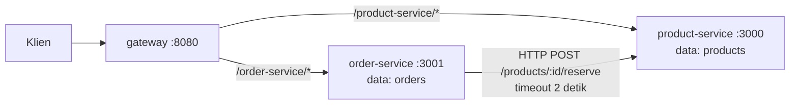

# Diagram Arsitektur Toko Setelah Dipecah

```mermaid
flowchart LR
    K[Klien] --> G[gateway :8080]
    G -->|/product-service/*| P[product-service :3000<br/>data: products]
    G -->|/order-service/*| O[order-service :3001<br/>data: orders]
    O -->|HTTP POST /products/:id/reserve<br/>timeout 2 detik| P
```

Aturan: order-service tidak membaca data produk secara langsung. Stok dan harga diminta lewat API product-service.
